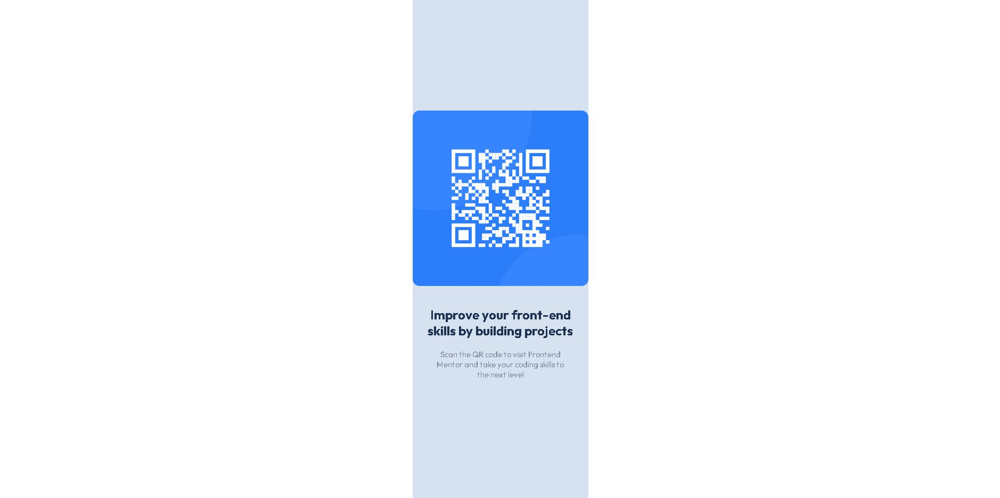

# Frontend Mentor - QR code component solution

This is a solution to the [QR code component challenge on Frontend Mentor](https://www.frontendmentor.io/challenges/qr-code-component-iux_sIO_H). Frontend Mentor challenges help you improve your coding skills by building realistic projects. 

## Table of contents

- [Overview](#overview)
  - [Screenshot](#screenshot)
  - [Links](#links)
- [My process](#my-process)
  - [Built with](#built-with)
  - [What I learned](#what-i-learned)
  - [Continued development](#continued-development)
  - [Useful resources](#useful-resources)
- [Author](#author)
- [Acknowledgments](#acknowledgments)

**Note: Delete this note and update the table of contents based on what sections you keep.**

## Overview

### Screenshot

### Links

- Solution URL: [Github](https://github.com/FelipeSousa92/Qr-Code-Component-Challenge)

## My process

### Built with

- Semantic HTML5 markup
- CSS custom properties
- Flexbox
- Mobile-first workflow

### What I learned

I've learned use proper HTML structure and semantic, responsive degign, CSS styling and variables, Flexbox layout and Google fonts integration. Overall, this example showcases the use of HTML, CSS & responsive design techniques. It demonstrates the importance of using proper HTML structure, leveraging CSS for styling and layout, and implementing responsive design practices for better use experiences across devices.

### Continued development

I would love to enhance the project by incorporating React.js (Javascript library) into the development process. It's a excellent choice for creating interactive and reusable UI components for user interfaces.

## Author

- Frontend Mentor - [@lhiroshi](https://www.frontendmentor.io/profile/lhiroshi)

**Note: Delete this note and add/remove/edit lines above based on what links you'd like to share.**

